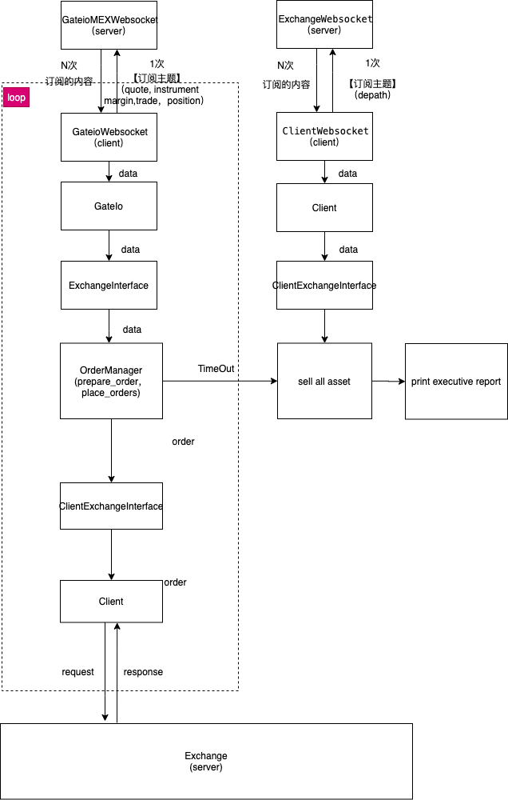

###  Sample Market Maker

该服务根据bitmex[https://github.com/Behappy123/market-maker]提供的做市商机器人结构改造而成。

### 介绍

```
sample-market-maker
├── README.md   #说明文件
├── runserver.py #启动文件，创建多个服务
├── market_maker 
│   ├── __init__.py
│   ├── auth    #认证服务，目前没有用上
│   │   ├── APIKeyAuth.py
│   │   ├── APIKeyAuthWithExpires.py
│   │   ├── AccessTokenAuth.py
│   │   ├── __init__.py
│   ├── client.py  #需要服务的交易所（hudex）相关文件
│   ├── gateio.py  #提供原始数据服务的相关文件
│   ├── market_maker_inner.py #创建order服务文件
│   ├── settings.py           #配置文件
│   ├── utils
│   │   ├── __init__.py
│   │   ├── constants.py      
│   │   ├── dotdict.py
│   │   ├── errors.py
│   │   ├── log.py
│   │   └── math.py     #价格策略工具
│   └── ws
│       ├── __init__.py
│       ├── client_ws_thread.py  #需要服务的交易所（hudex）client端websocket
│       └── gateio_ws_thread.py  #提供原始数据服务的client端websocketket
├── requirements.txt             #包依赖文件
└── test    #测试相关文件夹
    ├── test_gateio.py          
    ├── test_quantity.py
    ├── websocket-apikey-auth-test.py
    ├── websocket-multiplexing-test.py
    └── ws_thread_bak.py
```




GateIo 相关模块提供交易市场原始数据，client相关模块对原始数据再加工，创建属于自己的订单，将创建好的订单发往需要此服务的交易所（比如hudex）后端。

### 极速体验

##### 环境安装：

1.python版本：python3.7.7    其它python3版本亦可

2.包安装：切换到Sample Market Maker目录下，执行pip3 install -r requirements.txt

3.pm2:管理该服务的进程管理工具

```python
#pm2安装：
	npm install -g pm2
#pm2启动服务：
	pm2 start run server.py --name market-maker --interpreter python3
#pm2停止服务：
	pm2 stop market-maker
#pm2使用说明：
	[https://www.jianshu.com/p/e15fd72727fe]
```

##### 配置文件：

配置文件在market_maker目录下settings.py文件中，每个配置项有注释说明，可以根据注释去配置。

配置项MarketMakers说明：

```python

MarketMakers = [
		#以子进程的方式创建3s周期的market-maker服务
    {"CycleTime": 3, "Email": "youtao.xin.com", "Password": "12abcd"},
  	#创建5s周期的market-maker服务
    {"CycleTime": 5, "Email": "python_runzg@163.com", "Password": "1352zr"},
]

```


##### 启动：

直接启动：

```python
第一步：切换到Sample Market Maker目录下，

第二步：python3 runserver.py
```

pm2启动：

```python
第一步：切换到Sample Market Maker目录下

第二步：pm2 start runserver.py --name market-maker --interpreter python3

```


 


